# Juice V1 Architecture Diagram

This document contains a Mermaid diagram mapping the complete class hierarchy of the Juice V1 system. It outlines the core node controllers, effect base classes, domain-specific implementations, and meta-utilities.

### System Overview
The **Juice System** is a robust, non-destructive, component-based visual effects framework for Godot 4.x. Designed with a separation-of-concerns architecture, it prevents the common issue of visual effects permanently drifting or breaking a node's base state. 

Key architectural pillars:
- **Domain Nodes (`JuiceControl`, `Juice2D`, `Juice3D`)**: Act as localized orchestrators that attach to target nodes. They detect external changes, capture base states, and safely apply combined effect deltas once per frame.
- **Effects as Data (`JuiceEffectBase`)**: Effects are purely mathematical, stateless Resource objects. They never mutate the target node directly; they only calculate a "delta" (offset) for a given progress value.
- **Domain Separation**: A strict type system (via `JuiceRecipe` whitelists) ensures that 2D effects can only be applied to 2D nodes, Control effects to UI nodes, etc., preventing runtime type crashes.
- **Safe Stacking**: Multiple effects (e.g., Shake, Squash, Transform) can be stacked on the same node. The Domain Node aggregates all their deltas and performs a single, unified write operation to the Godot Engine.
- **Debug Logging** (`JuiceLogger` / `JuiceDebugReport`): A cross-cutting, three-tier gated logging system. Zero cost in export builds. Produces timestamped per-session log files and exportable JSON bug reports.

```mermaid
graph LR
    %% Base Godot Classes
    Node_Root("Godot Node"):::GodotClass
    Resource_Root("Godot Resource"):::GodotClass

    %% CORE NODES ==========================================
    Node_Root --> JuiceBase:::CoreNode
    
    Note_JuiceBase("📝 DOMAIN ORCHESTRATOR<br>Captures base state, detects external changes,<br>aggregates deltas, and performs single per-frame write."):::PostIt
    JuiceBase -.-> Note_JuiceBase

    JuiceBase --> JuiceControl:::DomainNode
    JuiceBase --> Juice2D:::DomainNode
    JuiceBase --> Juice3D:::DomainNode

    %% RECIPES ==============================================
    Resource_Root --> JuiceRecipe:::CoreResource
    
    Note_Recipe("📝 TYPE SAFETY GATEWAY<br>Narrows inspector dropdowns to specific domains<br>(e.g. 2D effects for 2D nodes) to prevent crashes."):::PostIt
    JuiceRecipe -.-> Note_Recipe

    JuiceRecipe --> JuiceControlRecipe:::DomainResource
    JuiceRecipe --> Juice2DRecipe:::DomainResource
    JuiceRecipe --> Juice3DRecipe:::DomainResource

    %% EFFECT BASES =========================================
    Resource_Root --> JuiceEffectBase:::CoreResource
    
    Note_EffectBase("📝 PURE DATA COMPONENT<br>Stateless math calculator. Never mutates target.<br>Outputs a single 'delta' per tick."):::PostIt
    JuiceEffectBase -.-> Note_EffectBase

    JuiceEffectBase --> JuiceControlEffectBase:::BaseClass
    JuiceEffectBase --> Juice2DEffectBase:::BaseClass
    JuiceEffectBase --> Juice3DEffectBase:::BaseClass

    %% CONTROL DOMAIN EFFECTS ===============================
    JuiceControlEffectBase --> JuiceControlAppearanceEffect:::BaseClass
    JuiceControlAppearanceEffect --> AppearanceControlJuiceEffect:::ConcreteClass

    JuiceControlEffectBase --> JuiceControlTransformEffect:::BaseClass
    JuiceControlTransformEffect --> TransformControlJuiceEffect:::ConcreteClass
    JuiceControlTransformEffect --> ShakeControlJuiceEffect:::ConcreteClass
    JuiceControlTransformEffect --> NoiseControlJuiceEffect:::ConcreteClass
    JuiceControlTransformEffect --> SquashStretchControlJuiceEffect:::ConcreteClass
    JuiceControlTransformEffect --> ProgressControlJuiceEffect:::ConcreteClass

    %% 2D DOMAIN EFFECTS ====================================
    Juice2DEffectBase --> Juice2DAppearanceEffect:::BaseClass
    Juice2DAppearanceEffect --> Appearance2DJuiceEffect:::ConcreteClass

    Juice2DEffectBase --> Juice2DTransformEffect:::BaseClass
    Juice2DTransformEffect --> Transform2DJuiceEffect:::ConcreteClass
    Juice2DTransformEffect --> Shake2DJuiceEffect:::ConcreteClass
    Juice2DTransformEffect --> Noise2DJuiceEffect:::ConcreteClass
    Juice2DTransformEffect --> SquashStretch2DJuiceEffect:::ConcreteClass
    Juice2DTransformEffect --> Progress2DJuiceEffect:::ConcreteClass

    %% 3D DOMAIN EFFECTS ====================================
    Juice3DEffectBase --> Juice3DAppearanceEffect:::BaseClass
    Juice3DAppearanceEffect --> Appearance3DJuiceEffect:::ConcreteClass

    Juice3DEffectBase --> Juice3DTransformEffect:::BaseClass
    Juice3DTransformEffect --> Transform3DJuiceEffect:::ConcreteClass
    Juice3DTransformEffect --> Shake3DJuiceEffect:::ConcreteClass
    Juice3DTransformEffect --> Noise3DJuiceEffect:::ConcreteClass
    Juice3DTransformEffect --> SquashStretch3DJuiceEffect:::ConcreteClass
    Juice3DTransformEffect --> Progress3DJuiceEffect:::ConcreteClass

    %% META: PROPERTY EFFECTS ===============================
    JuiceEffectBase --> PropertyJuiceEffectBase:::BaseClass
    
    PropertyJuiceEffectBase --> PropertyInterpolateJuiceEffectBase:::BaseClass
    PropertyInterpolateJuiceEffectBase --> PropertyInterpolateControlJuiceEffect:::ConcreteClass
    PropertyInterpolateJuiceEffectBase --> PropertyInterpolate2DJuiceEffect:::ConcreteClass
    PropertyInterpolateJuiceEffectBase --> PropertyInterpolate3DJuiceEffect:::ConcreteClass

    PropertyJuiceEffectBase --> PropertyNoiseJuiceEffectBase:::BaseClass
    PropertyNoiseJuiceEffectBase --> PropertyNoiseControlJuiceEffect:::ConcreteClass
    PropertyNoiseJuiceEffectBase --> PropertyNoise2DJuiceEffect:::ConcreteClass
    PropertyNoiseJuiceEffectBase --> PropertyNoise3DJuiceEffect:::ConcreteClass

    PropertyJuiceEffectBase --> PropertyShakeJuiceEffectBase:::BaseClass
    PropertyShakeJuiceEffectBase --> PropertyShakeControlJuiceEffect:::ConcreteClass
    PropertyShakeJuiceEffectBase --> PropertyShake2DJuiceEffect:::ConcreteClass
    PropertyShakeJuiceEffectBase --> PropertyShake3DJuiceEffect:::ConcreteClass

    JuiceEffectBase --> PropertyProgressJuiceEffectBase:::BaseClass
    PropertyProgressJuiceEffectBase --> PropertyProgressControlJuiceEffect:::ConcreteClass
    PropertyProgressJuiceEffectBase --> PropertyProgress2DJuiceEffect:::ConcreteClass
    PropertyProgressJuiceEffectBase --> PropertyProgress3DJuiceEffect:::ConcreteClass

    %% META: UTILITY EFFECTS ================================
    JuiceEffectBase --> CallMethodJuiceUtilityBase:::BaseClass
    CallMethodJuiceUtilityBase --> CallMethodControlJuiceUtility:::ConcreteClass
    CallMethodJuiceUtilityBase --> CallMethod2DJuiceUtility:::ConcreteClass
    CallMethodJuiceUtilityBase --> CallMethod3DJuiceUtility:::ConcreteClass

    JuiceEffectBase --> SceneActionJuiceUtilityBase:::BaseClass
    SceneActionJuiceUtilityBase --> SceneActionControlJuiceUtility:::ConcreteClass
    SceneActionJuiceUtilityBase --> SceneAction2DJuiceUtility:::ConcreteClass
    SceneActionJuiceUtilityBase --> SceneAction3DJuiceUtility:::ConcreteClass

    JuiceEffectBase --> SignalEmitJuiceUtilityBase:::BaseClass
    SignalEmitJuiceUtilityBase --> SignalEmitControlJuiceUtility:::ConcreteClass
    SignalEmitJuiceUtilityBase --> SignalEmit2DJuiceUtility:::ConcreteClass
    SignalEmitJuiceUtilityBase --> SignalEmit3DJuiceUtility:::ConcreteClass

    %% META: TIME EFFECTS ===================================
    JuiceEffectBase --> TimeJuiceEffectBase:::BaseClass
    TimeJuiceEffectBase --> TimeControlJuiceEffect:::ConcreteClass
    TimeJuiceEffectBase --> Time2DJuiceEffect:::ConcreteClass
    TimeJuiceEffectBase --> Time3DJuiceEffect:::ConcreteClass

    %% SCREEN & CAMERA EFFECTS ==============================
    JuiceEffectBase --> ScreenJuiceEffect:::ConcreteClass
    JuiceEffectBase --> ScreenOverlayJuiceEffectBase:::BaseClass
    ScreenOverlayJuiceEffectBase --> ScreenOverlayControlJuiceEffect:::ConcreteClass
    ScreenOverlayJuiceEffectBase --> ScreenOverlay2DJuiceEffect:::ConcreteClass
    ScreenOverlayJuiceEffectBase --> ScreenOverlay3DJuiceEffect:::ConcreteClass

    JuiceEffectBase --> Camera2DJuiceEffect:::ConcreteClass
    JuiceEffectBase --> Camera3DJuiceEffect:::ConcreteClass

    %% NODE UTILITIES =======================================
    Node_Root --> CameraJuiceUtility:::UtilityNode
    Node_Root --> SignalRelayJuiceUtility:::UtilityNode
    Node_Root --> TimeCoordinatorJuiceUtility:::UtilityNode
    Godot_Control("Godot Control"):::GodotClass --> SoftTriggerControlJuiceUtility:::UtilityNode
    Godot_Area2D("Godot Area2D"):::GodotClass --> SoftTrigger2DJuiceUtility:::UtilityNode
    Godot_Area2D --> Interaction2DJuiceUtility:::UtilityNode
    Godot_Area3D("Godot Area3D"):::GodotClass --> SoftTrigger3DJuiceUtility:::UtilityNode
    Godot_Area3D --> Interaction3DJuiceUtility:::UtilityNode

    %% META SUB-RESOURCES ===================================
    Resource_Root --> PropertyTarget:::BaseClass
    PropertyTarget --> InterpolatePropertyTarget:::ConcreteClass
    PropertyTarget --> NoisePropertyTarget:::ConcreteClass
    PropertyTarget --> ShakePropertyTarget:::ConcreteClass

    Resource_Root --> CallMethodEntry:::ConcreteClass
    Resource_Root --> SignalEmitEntry:::ConcreteClass

    %% DEBUG LOGGING SYSTEM =================================
    RefCounted_Root("Godot RefCounted"):::GodotClass

    RefCounted_Root --> JuiceLogger:::DebugUtil
    RefCounted_Root --> JuiceDebugReport:::DebugUtil

    Note_Logging("📝 CROSS-CUTTING DEBUG SERVICE<br>Three-tier gating: export-build strip → master switch → per-node flag.<br>Writes timestamped juice_*.log per session. Never overwrites."):::PostIt
    JuiceLogger -.-> Note_Logging

    %% Who calls JuiceLogger
    JuiceBase -. "log_info / warn" .-> JuiceLogger
    JuiceEffectBase -. "log_info / log_delta" .-> JuiceLogger

    %% JuiceDebugReport reads from JuiceLogger
    JuiceDebugReport -. "reads LOG_FILE_PATH" .-> JuiceLogger


    classDef GodotClass fill:#1c2433,stroke:#3e4c63,stroke-width:2px,color:#d8dee9;
    classDef CoreNode fill:#36537a,stroke:#5c81b5,stroke-width:2px,color:#fff;
    classDef CoreResource fill:#45594b,stroke:#6f8f79,stroke-width:2px,color:#fff;
    classDef DomainNode fill:#286b96,stroke:#44a3e3,stroke-width:1px,color:#fff;
    classDef DomainResource fill:#3b6949,stroke:#5eab75,stroke-width:1px,color:#fff;
    classDef BaseClass fill:#4f4333,stroke:#857157,stroke-dasharray: 5 5,color:#fff;
    classDef ConcreteClass fill:#6e333b,stroke:#b85663,stroke-width:1px,color:#fff;
    classDef UtilityNode fill:#5c4066,stroke:#9769a8,stroke-width:1px,color:#fff;
    classDef DebugUtil fill:#2e4a4f,stroke:#4a9eaa,stroke-width:2px,color:#fff;
    classDef PostIt fill:#fff59d,stroke:#fbc02d,stroke-width:1px,color:#000,stroke-dasharray: 0;
```

