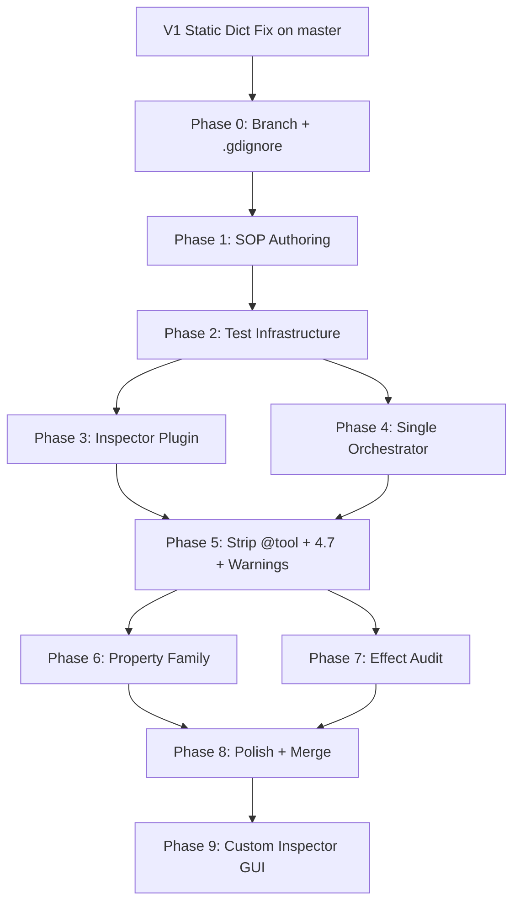

# Juice V2 Refactor — AI-Executable Project Plan (Rev 3)

> **Goal**: Migrate Juice from V1 (`@tool` monolith domain nodes) to V2 (separated runtime/editor, orchestrator pattern, custom inspector GUI) while reintroducing Property family with full Ledger compliance.
>
> **Constraint**: V1 stays in `addons/Juice_V1/` with `.gdignore`, V2 lives in `addons/Juice_V2/`.

---

## Resolved Decisions

| Question | Decision |
|----------|----------|
| Branch | `v2/refactor` off `master` after static dict ledger fix lands |
| Addon path | Parallel `addons/Juice_V2/`, V1 gets `.gdignore` |
| Godot version | **4.7** — Container hold removal |
| Property family | Phase 6, merges `feature/v1.1-property-family` |
| Config warnings | **Approach C** — plugin scene-change hook (fixes V1 refresh bugs too) |
| Orchestrator | **Single class** with mode enum — no duplication (see below) |

---

## Pending Input

> [!IMPORTANT]
> **Ledger isolation**: You mentioned the V1 static dict fix is landing now. Please provide the handover report when it's done — the V2 plan will adopt that implementation directly, and the shared-vs-isolated question will be answered with full context of how `source_id` cleanup works in the new static dict.

---

## Single Orchestrator — No Code Duplication

Your concern is valid: two orchestrator scripts means double maintenance. The V2 Architecture doc already proposed a **single `JuiceOrchestrator` class with a mode enum** — that's the right design. The Sparkle insight doesn't require two classes, it requires **two lifecycle strategies within one class**:

```
JuiceOrchestrator (single @tool class)
├── Mode.PREVIEW  → queue_free() on completion/teardown
└── Mode.RUNTIME  → stays alive, resets state per retrigger
```

**How this avoids GC stutter with one class:**
- `RUNTIME` mode: spawned once at domain node `_ready()`, lives until `_exit_tree()`. On retrigger, calls `reset()` which clears effect state and restarts the animation loop — **zero allocation, zero `queue_free()`**.
- `PREVIEW` mode: spawned by `JuicePreviewDirector`, `queue_free()`s on teardown — acceptable because editor performance doesn't matter.

**The key method that differs by mode:**

| Event | PREVIEW | RUNTIME |
|-------|---------|---------|
| Animation completes | `teardown()` → restore → `queue_free()` | `_on_complete()` → restore → idle (await next trigger) |
| Stop requested | `teardown()` → restore → `queue_free()` | `stop()` → restore → idle |
| Retrigger | N/A (preview doesn't retrigger) | `reset()` → restart animation loop (no reallocation) |

**`@tool` on a single class**: harmless at runtime because dynamically spawned nodes are never serialized. At editor time, allows `_process` for preview.

---

## Config Warnings — Approach C + Phase 9 Synergy

**Approach C chosen**: `juice_plugin.gd` listens to scene tree changes and drives `update_configuration_warnings()` on Juice nodes programmatically.

**V1 flaws to fix in V2**:
- Warnings don't refresh when recipe/effects are added (stale cache)
- Juice node doesn't recognize it has a recipe set (timing issue with `_validate_property` running before resource load)

**V2 fix strategy**:
1. Plugin registers `EditorInterface.get_selection().selection_changed` signal
2. On scene change / selection change, plugin iterates all Juice nodes in scene
3. Plugin calls a static validation function (NOT on the domain node) that checks recipe, target, effect registration
4. Plugin calls `node.update_configuration_warnings()` with results
5. Domain nodes implement `_get_configuration_warnings()` as a **pure read** — no `@tool` needed because the plugin triggers the refresh externally

**Phase 9 bonus**: The custom inspector GUI can also display inline warnings with styled banners (like Sparkle's diagnostic panel), giving BOTH scene-tree icons AND rich inspector-level diagnostics.

---

## Phase 0 — Branch Setup & V1 Baseline

**Prerequisite**: V1 static dict ledger fix must be committed to `master` first.

**Steps**:
1. Ensure `master` is clean with static dict fix landed
2. `git checkout -b v2/refactor master`
3. Add `.gdignore` to `addons/Juice_V1/`
4. Copy `addons/Juice_V1/` → `addons/Juice_V2/`
5. Run full V1 test suite (on master, before `.gdignore`), save as `Documentation/V2_Refactor/v1_baseline_results.log`
6. Create `Documentation/V2_Refactor/V2_Refactor_Tracker.md`
7. `git tag v1-baseline`

**Gate**: Branch exists, V1 `.gdignore`'d, V2 dir created, baseline captured.

---

## Phase 1 — SOP Authoring

> [!NOTE]
> Also incorporates the SOP gap from `Upgrades and fixes TO DO.md`: the `/realistic-test` workflow rework.

### 1.1 — New/Updated Rules

| Rule | Purpose |
|------|---------|
| `v2-architecture-contracts.md` | L2 split: L2-Runtime + L2-Editor. Single orchestrator with mode enum. |
| `v2-tool-surface.md` | Whitelist: `juice_plugin.gd`, `JuiceOrchestrator`, `JuiceEditorInspectorPlugin`, `JuicePreviewDirector`. |
| `v2-anti-patterns.md` | Bans: `Engine.is_editor_hint()` in domain nodes, `_validate_property()` in domain nodes, per-trigger `queue_free()` at runtime. |

### 1.2 — Updated Skills

| Skill | Key Changes |
|-------|-------------|
| `juice-architecture` | Single orchestrator contract (mode enum, RUNTIME stays alive). Config warnings via plugin. |
| `juice-classes` | Add `JuiceOrchestrator`, `JuiceEditorInspectorPlugin`, `JuiceOrchestratorFactory`. |
| `unit-test-patterns` | Orchestrator lifecycle + retrigger-without-reallocation tests. |

### 1.3 — New/Updated Workflows

| Workflow | Purpose |
|----------|---------|
| `/v2-port` | Same domain order (2D→Control→3D), effects NOT `@tool`, orchestrator test gate |
| `/v2-refactor` | "Verify no @tool leakage" + "verify orchestrator lifecycle" |
| `/v2-test` | Orchestrator, inspector plugin, property ledger suites |
| `/v2-inspector-extract` | One-time: `_validate_property()` → `_parse_property()` |
| `/v2-orchestrator-build` | One-time: single orchestrator + factory |
| `/realistic-test` (REWORK) | **Fix the SOP gap**: integrate MCP non-headless testing, write helper skill per `@create-quality-skill` |

**Gate**: All SOPs committed. Zero production code changes.

---

## Phase 2 — Test Infrastructure Bootstrapping

Empty test suites registered in runner:

| Suite | Written During |
|-------|----------------|
| `TestEditorInspectorPlugin.gd` | Phase 3 |
| `TestOrchestrator.gd` | Phase 4 |
| `TestOrchestratorFactory.gd` | Phase 4 |
| `TestPropertyLedger.gd` | Phase 6 |
| `TestPropertyStacking.gd` | Phase 6 |
| `TestContainerControl47.gd` | Phase 5 |
| `TestConfigWarnings.gd` | Phase 5 |

Also: `tests/mcp_editor/` directory with Tier 2 test templates.

**Gate**: Runner executes with 0 new tests. V1 baseline unaffected.

---

## Phase 3 — EditorInspectorPlugin Extraction (V2-A)

1. Audit all `_validate_property()` across JuiceBase, domain nodes, effects
2. Create `addons/Juice_V2/Editor/JuiceEditorInspectorPlugin.gd`
3. Register in `juice_plugin.gd`
4. Delete all `_validate_property()` from domain nodes
5. Write tests + MCP Tier 2 verification
6. Run full suite

**Gate**: Zero `_validate_property()` outside plugin. Inspector verified.

---

## Phase 4 — Single Orchestrator & Factory (V2-B)

1. **Create** `JuiceOrchestrator.gd` (`@tool`, single class):
   - Mode enum: `PREVIEW`, `RUNTIME`
   - `setup(recipe, target, mode)` → clone effects, resolve target, register ledger
   - `play()` → begin `_process` loop
   - `reset()` → clear effect state, restart (RUNTIME retrigger — zero allocation)
   - `stop()` → stop animation, restore target (RUNTIME: stay alive; PREVIEW: `queue_free()`)
   - `teardown()` → restore, deregister ledger, `queue_free()` (PREVIEW only)
2. **Create** `JuiceOrchestratorFactory.gd` — `create(recipe, target, mode)` entry point
3. **Modify** `JuicePreviewDirector.gd` — use factory for PREVIEW mode
4. **Write tests** covering:
   - PREVIEW lifecycle: spawn → play → teardown → freed
   - RUNTIME lifecycle: spawn → play → complete → idle → retrigger → no new allocation
   - Ledger cleanup after both modes
5. Run full suite — transport tests pass

**Gate**: Single orchestrator handles both modes. Zero per-trigger allocation in RUNTIME.

---

## Phase 5 — Strip @tool + 4.7 Container + Config Warnings (V2-C/D)

1. Remove `@tool` from `JuiceBase.gd`, `Juice2D.gd`, `Juice3D.gd`, `JuiceControl.gd`
2. Remove all `Engine.is_editor_hint()` guards
3. Remove preview lifecycle code (now in orchestrator)
4. Remove `_runtime_effects` cloning (now in orchestrator)
5. **Godot 4.7 Container cleanup**:
   - Remove frame-by-frame container hold pattern
   - Simplify layout shift detection
   - Remove `_sort_children()` fighting workarounds
6. **Config warnings (Approach C)**:
   - Implement plugin scene-change listener
   - Create static `JuiceConfigValidator` class (pure read, no `@tool` needed)
   - Plugin calls `node.update_configuration_warnings()` on scene/selection changes
   - Fix V1 stale-warning bugs by design (plugin drives refresh externally)
7. Domain node `_ready()` spawns orchestrator via factory (RUNTIME mode)
8. Domain node `_process()` removed (orchestrator handles tick)
9. Verify `@tool` surface — only whitelisted files
10. Write `TestConfigWarnings.gd` + `TestContainerControl47.gd`

**Gate**: Zero `@tool` outside whitelist. Config warnings work reliably. Container tests pass on 4.7.

---

## Phase 6 — Property Family Reintroduction

1. Cherry-pick/merge from `feature/v1.1-property-family`
2. Implement generic property channel in JuiceLedger (per `PropertyFamily_Ledger_Refactor.md`)
3. Refactor PropertyJuiceEffectBase — remove `set_indexed()`, register delta
4. Update orchestrator — `flush_properties()` in post-tick write
5. Update PropertyTarget — register base with Ledger
6. Write all 5 required tests
7. Register in all three domain recipes
8. Remove "Approved Direct-Write Exception" from L3 contract

**Gate**: Property effects are pure delta calculators. Stacking works. All tests pass.

---

## Phase 7 — Systematic Effect Audit (V2-E)

1. Grep `addons/Juice_V2/` for editor code: `Engine.is_editor_hint()`, `_on_editor_pre_save()`, `_validate_property()`, `@tool`
2. Per flagged file: remove guards, move baking to plugin `_save_external_data()`
3. Write baked cache regression test for `CaptureAt.IN_EDITOR` effects
4. Port order: 2D → Control → 3D per family
5. Update V2 Migration Tracker

**Gate**: Zero editor code in non-whitelisted files. Regression test passes.

---

## Phase 8 — Polish, Documentation & Merge

1. SOP cleanup: archive V1 SOPs, rename V2 → defaults
2. Doc sweep: remove migration language
3. Update design docs (V2 Architecture → "Implemented", Property Refactor → "Complete")
4. Full test run: headless + MCP Tier 2, compare against baseline
5. Demo scene verification
6. Merge to `master`, tag `v2.0`
7. Decide: delete V1 or keep as reference (remove `.gdignore` if keeping)

**Gate**: All tests pass. Demos work. Merged.

---

## Phase 9 — Custom Inspector GUI (Post-Merge)

Leverage `JuiceEditorInspectorPlugin` to build a premium recipe editor:

1. `JuiceRecipeEditorProperty.gd` (extends `EditorProperty`) — custom recipe stack
2. `JuiceEffectEntryEditor.gd` — per-effect row (icon, label, toggle, expand, drag-drop, actions menu)
3. `JuiceEffectTypeRegistry.gd` — icons, colors, labels per effect type
4. Juice-branded styling: `StyleBoxFlat` panels, color palette, micro-animations
5. Inline preview button (wired to orchestrator PREVIEW mode)
6. **Inline config warnings**: styled diagnostic banners in inspector (supplements scene-tree icons from Approach C)
7. "Total Duration" label, paste support, undo/redo integration
8. MCP Tier 2 tests for custom GUI

**Config warnings synergy**: Phase 9 provides **both** scene-tree warning icons (Approach C) AND rich inline inspector diagnostics (like Sparkle's diagnostic banner). This is strictly better than V1's flaky yellow triangles.

**Gate**: Custom inspector renders. All interactions work. Marketplace-ready.

---

## Phase Dependency Graph



---

## Agent Handoff Protocol

Each phase = 1-3 conversations. At phase end:
1. Commit: `V2 Phase N: [summary]`
2. Update `V2_Refactor_Tracker.md`
3. Run full suite, record results
4. Create conversation summary

Next-phase agent reads tracker → SOPs → previous results → `git status` → proceed.

---

## Risk Registry

| Risk | Mitigation |
|------|------------|
| `_parse_property()` ordering differs from `_validate_property()` | Phase 3 MCP Tier 2 verification |
| `_save_external_data()` timing mismatch | Phase 7 baked cache regression test |
| Property family merge conflicts | Phase 6 resolves before Ledger work |
| Orchestrator RUNTIME mode state leak on retrigger | Phase 4 test: "reset clears all state" |
| 4.7 Container behavior surprises | Phase 5 dedicated test suite |
| `update_configuration_warnings()` doesn't fire without `@tool` | Phase 5: verify Godot API allows external trigger; fallback to Approach B if not |
| Custom inspector GUI complexity | Phase 9 is post-merge, can ship V2 without it |

---

## Scope

| Phase | Conversations | Key Deliverables |
|-------|--------------|-----------------|
| 0 | 1 | Branch, .gdignore, baseline |
| 1 | 2-3 | ~15 SOP files + /realistic-test rework |
| 2 | 1 | ~8 test stubs |
| 3 | 2-3 | Inspector plugin + deletions |
| 4 | 2-3 | Single orchestrator + factory |
| 5 | 2-3 | Domain rewrites + 4.7 + config warnings |
| 6 | 3-4 | Ledger generics + property effects |
| 7 | 3-5 | All effect files cleaned |
| 8 | 1-2 | Docs, merge, tag |
| 9 | 3-5 | Custom inspector GUI |
| **Total** | **~20-30** | **~80-90 files, ~120 new assertions** |
